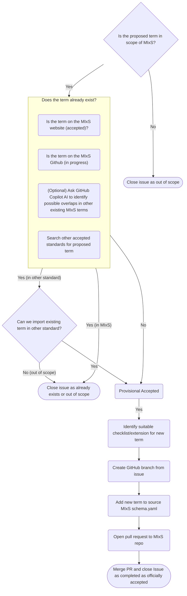

# Process for New MIxS Term creation or Revising Existing Terms

This document outlines the process for proposing new MIxS terms or revising existing ones.

It is intended to act primarily as a reference guide for the Compliance and Interoperability (CIG) and Technical Working Group (TWG) on the steps for adding a new term, or revisiting an existing term, in the MIxS standard.

## Decision tree

## Detailed Description of Steps

1. A new term gets proposed via a GitHub Issue
2. The CIG performs a first-pass review to ensure the proposal is in scope for MIxS
   1. If out of scope, the issue is closed as "out of scope"
   2. If in scope, proceed to step 3
3. The CIG checks if the term already exists in the MIxS standard or other related standards.
   1. Search the [MIxS website](https://gensc.org/mixs/) for same or related terms already within the latest MIxS standard (latest approved and completed terms)
   2. Search the [MIxS GitHub repository](https://github.com/GenomicsStandardsConsortium/mixs) for same or related terms (currently under review or in progress terms, not yet approved)
   3. Optionally, use GitHub Copilot AI to identify possible overlaps with other existing MIxS terms
   4. Search other accepted standards for the same or similar proposed term
4. If the term already exists in MIxS, the issue is closed as "already exists"
5. If the term exists in another standard, evaluate if it can be imported into MIxS
   1. If it can be imported, proceed to step 6
   2. If it cannot be imported either consider a new or issue is closed as "out of scope"
6. If the term does not exist in MIxS or can be imported from another standard, the term is provisionally accepted and the CIG identifies the most suitable checklist/extension for the new term
7. CIG identifies most suitable checklist or extension for the term
8. A TWG member creates a GitHub branch from the issue
9. The TWG member adds the new term to the source MIxS `schema.yaml` while on the branch
10. The TWG member opens a pull request to the MIxS repository
11. The CIG and TWG review the pull request
12. Once approved, the pull request is merged and the issue is closed as completed and officially accepted

---

_Partially written with the assistance of Github Copilot_
