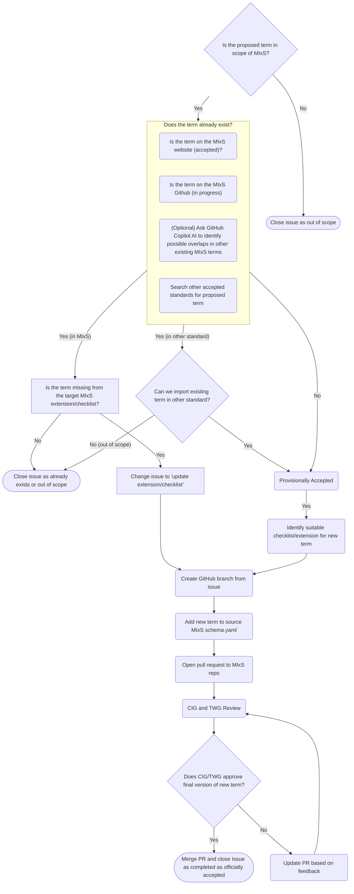

# Process for New MIxS Term creation or Revising Existing Terms

This document outlines the process for proposing new MIxS terms or revising existing ones.

It is intended to act primarily as a reference guide for the Compliance and Interoperability (CIG) Working Group and Technical Working Group (TWG) on the steps for adding a new term, or revisiting an existing term, in the MIxS standard.

## Decision tree

## Detailed Description of Steps

1. A new term gets proposed via a GitHub Issue
   - Proposal must include: term name, definition, expected values, source of terms (if appropriate)
2. The CIG performs a first-pass review to ensure the proposal is in scope for MIxS
   1. If out of scope, the issue is closed as "out of scope"
   2. If in scope, proceed to step 3
3. The CIG checks if the term already exists in the MIxS standard.
   1. Search the [MIxS website](https://genomicsstandardsconsortium.github.io/mixs/) for same or related terms already within the latest MIxS standard (latest approved and completed terms)
   2. Search the [MIxS GitHub repository](https://github.com/GenomicsStandardsConsortium/mixs) for same or related terms (currently [under review](https://github.com/GenomicsStandardsConsortium/mixs/pulls) or [in-progress terms](https://github.com/GenomicsStandardsConsortium/mixs/issues), not yet approved)
   3. Optionally, use GitHub Copilot AI to identify possible overlaps with other existing MIxS terms
   4. If the term already exists in MIxS, either:
      - Close the issue tagging as "already exists", with a link to the existing term
      - Change issue to 'update extension/checklist' referring to the target extension that is missing the term (and continue from branch creation below)
4. The CIG search other high-quality and established non-MIxS standards for terms with the same definition or similar to the proposed term
   1. If the term exists in another standard, evaluate if it can be mapped into MIxS (i.e. copied and linked back)
      - If it can be mapped, proceed to step 5
      - If it cannot be mapped consider either: create new MIxS term, or close the ticket as out of scope.
5. If the term does not exist in MIxS or can be mapped from another standard, the term is provisionally accepted and the CIG identifies the most suitable checklist/extension for the new term
6. CIG communicates back to submitter of the proposed term, to get approval of changes made by CIG during review
   - Possible changes: term name, revising definition, verify identified mappings sufficient
7. CIG identifies other relevant checklists or extensions the term should be added too
8. A TWG member creates a GitHub branch from the issue
9. The TWG member adds the new term to the source MIxS `schema.yaml` while on the branch
10. The TWG member opens a pull request to the MIxS repository
11. The original requester, the CIG and TWG review the pull request
12. Once approved by members of all three groups, the term is assigned a MIxS ID
    - Currently performed manually (CIG has internal document for this), in the future will be automated
13. The pull request is merged and the issue is closed as completed and officially accepted

---

_Partially written with the assistance of Github Copilot_
